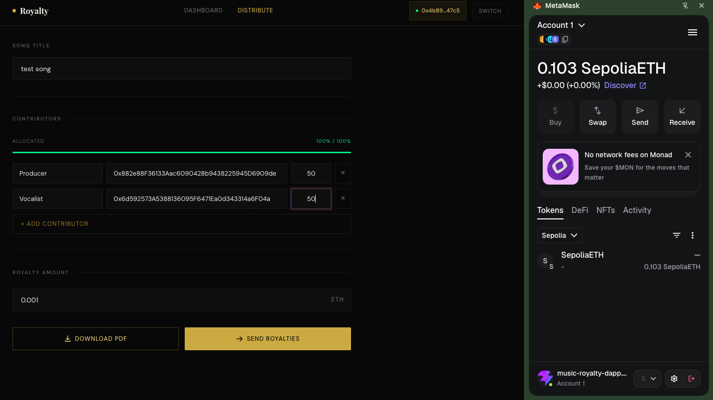
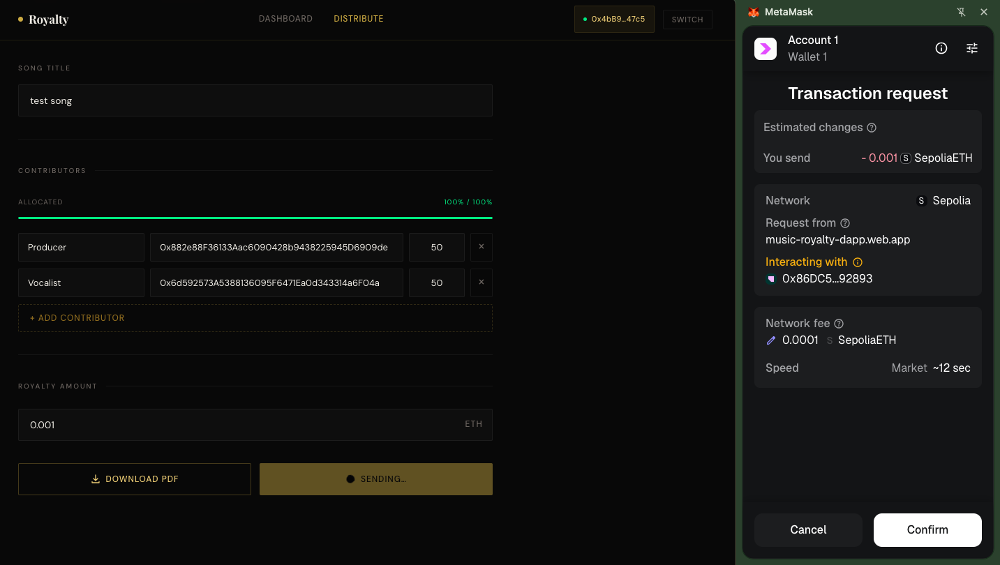

---

```md
# 🎵 Music Royalty DApp (Web3 Smart Royalty Splitter)

A decentralized music royalty distribution platform built with **Solidity, Hardhat, React (Vite), and Ethereum Sepolia testnet**.

This dApp allows artists to create songs, define contributor royalty splits, and automatically distribute ETH payments transparently on-chain without intermediaries.

---

## 🚀 Live Features

- 🎶 Create songs with multiple contributors
- 💰 Define royalty percentage splits per wallet
- ⚡ Instant ETH distribution via smart contracts
- 📊 Real-time dashboard for songs and transactions
- 🔗 MetaMask wallet integration
- 🧾 Factory + Splitter smart contract system
- 📈 On-chain transparency via Ethereum events

---

## 🧱 Tech Stack

**Smart Contracts**
- Solidity ^0.8.x
- Hardhat
- OpenZeppelin Contracts

**Frontend**
- React (Vite)
- Ethers.js v6
- Framer Motion
- Custom CSS UI system (2026 modern design)

**Blockchain**
- Ethereum Sepolia Testnet
- Alchemy RPC
- MetaMask

**Deployment**
- Firebase Hosting (Frontend)

---

## 📁 Project Structure

```

music-royalty-dapp/
│
├── contracts/
│   ├── RoyaltyFactory.sol
│   ├── RoyaltySplitter.sol
│
├── scripts/
│   ├── deploy.cjs
│
├── src/
│   ├── pages/
│   │   ├── Dashboard.jsx
│   │   ├── CreateSong.jsx
│   ├── blockchain/
│   │   ├── factory.js
│
├── hardhat.config.ts
├── package.json
└── README.md

````
## 📸 Screenshots

````





````
---

## ⚙️ Smart Contract Architecture

### 🔹 RoyaltyFactory
- Deploys new song contracts
- Stores all created songs
- Handles global song registry

### 🔹 RoyaltySplitter
- Holds ETH for each song
- Splits royalties among contributors
- Emits events for tracking payments

---

## 🛠️ Installation & Setup

### 1. Clone repository
```bash
git clone https://github.com/yourusername/music-royalty-dapp.git
cd music-royalty-dapp
````

---

### 2. Install dependencies

```bash
npm install
```

---

## 🔐 Environment Setup

Create a `.env` file:

```env
SEPOLIA_RPC_URL=https://eth-sepolia.g.alchemy.com/v2/YOUR_ALCHEMY_KEY
PRIVATE_KEY=your_wallet_private_key
```

⚠️ Use only test wallets. Never expose real funds.

---

## ⛓️ Compile contracts

```bash
npx hardhat compile
```

---

## 🚀 Deploy contracts (Sepolia)

```bash
npx hardhat run scripts/deploy.cjs --network sepolia
```

After deployment, copy factory address:

```js
0xYourDeployedFactoryAddress
```

Update it in:

```
src/blockchain/factory.js
```

---

## 💻 Run frontend locally

```bash
npm run dev
```

Open:

```
http://localhost:5173
```

---

## 🌐 Deploy frontend to Firebase

### 1. Install Firebase CLI

```bash
npm install -g firebase-tools
```

### 2. Login

```bash
firebase login
```

### 3. Initialize Firebase

```bash
firebase init
```

Select:

* Hosting
* Public directory: `dist`
* SPA: YES

### 4. Build project

```bash
npm run build
```

### 5. Deploy

```bash
firebase deploy
```

---

## 🔁 How It Works

1. Artist creates a song on frontend
2. Factory deploys a splitter contract
3. Contributors are assigned shares
4. User sends ETH royalty payment
5. Smart contract automatically distributes ETH
6. Contributors receive funds instantly

---

## 📊 Key Features

### ✔ Fully On-chain Royalties

No backend server. Everything runs on Ethereum.

### ✔ Transparent Payments

Every transaction is verifiable on Etherscan.

### ✔ Modular Contract System

Factory pattern creates independent royalty contracts per song.

---

## ⚠️ Common Issues

### ❌ MetaMask insufficient funds

* Ensure you are on Sepolia network
* Get test ETH from faucet

### ❌ Contract not working

* Ensure correct factory address in frontend

### ❌ Transactions failing

* Ensure correct network (Sepolia vs Hardhat local)

---

## 🧠 What This Project Demonstrates

* Smart contract architecture (Factory + Splitter pattern)
* Web3 frontend integration with React + Ethers
* Wallet authentication using MetaMask
* Decentralized payment distribution system
* Real-world blockchain application design

---

## 🔮 Future Improvements

* IPFS music upload system
* NFT-based song ownership
* Streaming-based royalty tracking
* Analytics dashboard for artists
* Mainnet deployment

---

## 👨‍💻 Author

Built by **Magnus Achor (Daddi Cool)**
Software Engineer | Web3 Developer | Digital Creator

---

## 📜 License

MIT License

